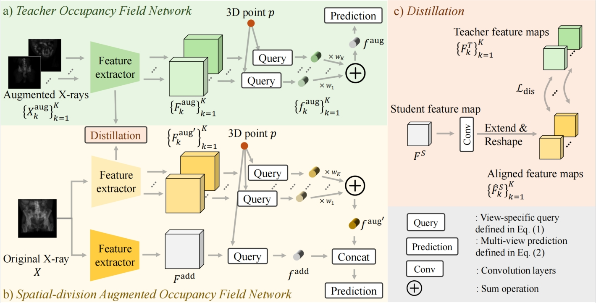
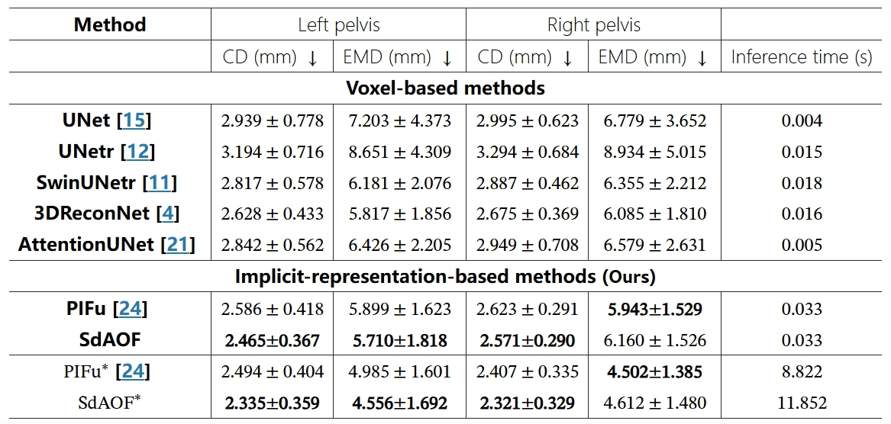
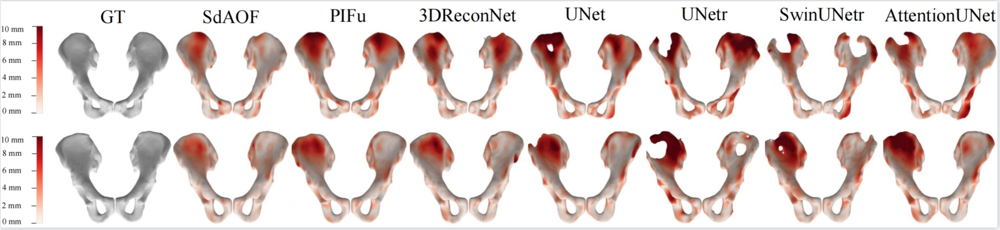

<div align=center>
<h1> Spatial-Division Augmented Occupancy Field for Bone Shape Reconstruction from Biplanar X-Rays </h1>
</div>
<div align=center>

<a src="https://img.shields.io/badge/%F0%9F%93%96-MICCAI_2024-red.svg?style=flat-square" href="https://link.springer.com/chapter/10.1007/978-3-031-72104-5_64">

</a>
   
<a src="https://img.shields.io/badge/%F0%9F%9A%80-xmed_Lab-ed6c00.svg?style=flat-square" href="https://xmengli.github.io/">

</a>
</div>

## :rocket: Updates
- The code of SdAOF training & test are released (in ``./scripts``).
- The pipeline of preprocessing ``Totalsegmentor-hip`` to ``Totalsegmentor_Pelvis_Bone_Recon_Dataset`` to compatable for efficient training is released (in ``./Data_Preprocess``).
- [To-do] Release dataset for bone mesh reconstruction ``Totalsegmentor_Pelvis_Bone_Recon_Dataset``. We are updating the dataset to online disks, this will be updated within 2 days.

## :star: Highlights of SdAOF
- SdAOF introduces continuous occupancy field representation for efficient high-resolution bone shape reconstruction from biplanar X-ray images.
- SdAOF integrates a spatial-division augmented distillation strategy to capture prevalent occlusion relationship within X-ray images.
- SdAOF achieves SoTA performance in biplanar bone shape reconstruction, reconstructing fine-scale bone surfaces and is scalable to different resolutions without retraining.

## :hammer: Environment
- The required CUDA version is 11.3, please ensure using this version in your environment, you may refer to this [guideline](https://www.cnblogs.com/kevin-matrix/p/18199741) to keep a separate CUDA version for the new environment.

- Download the code, create a conda environment, and install the required packages in ``requirements.txt`` by running the following commands:
    ```shell
    git clone https://github.com/xmed-lab/SdAOF.git
    cd SdAOF
    conda create -n SdAOF python=3.9
    conda activate SdAOF
    pip install -r ./requirements.txt
    ```

- TIGRE is required for simulating DRRs and geometry utils, install TIGRE by running
    ```shell
    wget https://github.com/CERN/TIGRE/archive/refs/tags/v2.6.zip
    unzip v2.6.zip
    pip install TIGRE-2.6/Python --no-build-isolation
    ```

- Pointnet2 is required for calculating chamfer distance and earth mover's distance metrics, install Pointnet 2 by running
    ```shell
    cd ./scripts/metrics/pointnet2
    python setup.py install
    ```

## :computer: Prepare Dataset
- We provide the processed ``Totalsegmentor_Pelvis_Bone_Recon_Dataset`` links: [BaiduNetdisk](TBD);  [OneDrive](TBD).

- Since processing the dataset is time-consuming, we suggest directly downloading and using the processed ``Totalsegmentor_Pelvis_Bone_Recon_Dataset``.

- We also provide step-by-step instructions to reproduce the preprocessing pipeline in ``./Data_Preprocess``. If you are interested, please refer to it for more details.

## :key: Train and Evaluate
- We provide the checkpoint of trained Teacher OF Net and SdAOF Net in the following links, you can download them for direct inference

    |      Net       |                                                                                                  Link                                                                                                  |
    |:--------------:|:------------------------------------------------------------------------------------------------------------------------------------------------------------------------------------------------------:|
    | Teacher OF Net | [BaiduNetdisk](https://pan.baidu.com/s/1JLEvW148HWowrpf8VYtPtw?pwd=unyg);  [OneDrive](https://hkustconnect-my.sharepoint.com/:u:/g/personal/jchenhu_connect_ust_hk/EbAA0ypkSlFArr--BvzP4d0Br2_2XZXnnL4V9xpnr13QnQ?e=xYxYuk) |
    |   SdAOF Net    |                                                  [BaiduNetdisk](https://pan.baidu.com/s/1z8coZNOTfnywzyU3j33Y1w?pwd=ay8u);  [OneDrive](https://hkustconnect-my.sharepoint.com/:u:/g/personal/jchenhu_connect_ust_hk/EXW0H9C_9hBGvF7W9ef1ZwoBZEK7JvqKmYH30sSVB-wG0w?e=bZqOvb)                                                   |
- All scripts related to training and evaluation are in ``./scripts``. Change to this directory first: ``cd ./scripts``.
- The training of SdAOF consists of two stages.
  - Train the Teacher OF Net by running
    ```python
    CUDA_VISIBLE_DEVICES="YOUR_GPU_ID" python train_teacher_OFNet.py --name Teacher_OF_Net --data_root YOUR_DIRECTORY_TO_DATASET --out_res 128 --save_interval 50 --eval_interval 50 
    ```
    The saved checkpoint is in ``./scripts/logs/Teacher_OF_Net/best_epoch.pth`` by default.
  - Train the SdAOF Net by running
    ```python
    CUDA_VISIBLE_DEVICES="YOUR_GPU_ID" python train_SdAOFNet.py --name SdAOF --data_root YOUR_DIRECTORY_TO_DATASET --teacher_ckpt_path YOUR_DIRECTORY_TO_SAVED_TEACHER_OFNET_CHECKPOINT --out_res 128 --save_interval 50 --eval_interval 50 --distill_individual_feat_alpha 0.2  
    ```
    The saved checkpoint is in ``./scripts/logs/SdAOF/best_epoch.pth`` by default.
  - During training, you can config your ``wandb`` account, and track training statistics by adding configurations as below
    ```shell
    --wandb --project WANDB_PROJECT_NAME --entity YOUR_WANDB_ENTITY
    ```
- Evaluate the trained SdAOF by running
    ```shell
    CUDA_VISIBLE_DEVICES="YOUR_GPU_ID" python eval.py --name SdAOF --data_root YOUR_DIRECTORY_TO_DATASET --ckpt_path YOUR_DIRECTORY_TO_SAVED_SdAOFNET_CHECKPOINT --out_res 336 --eval_mesh_npoint 4096 
    ```
  Evaluation results is saved in ``./scripts/Eval_results``.

## :blue_book: Results




## :books: Citation
If you find our paper helps you, please kindly cite our paper in your publications.
```text
@inproceedings{chen2024spatial,
  title={Spatial-division augmented occupancy field for bone shape reconstruction from biplanar x-rays},
  author={Chen, Jixiang and Lin, Yiqun and Sun, Haoran and Li, Xiaomeng},
  booktitle={International Conference on Medical Image Computing and Computer-Assisted Intervention},
  pages={668--678},
  year={2024},
  organization={Springer}
}
```

## :beers: Acknowledge
We sincerely appreciate [XrayTo3DPreprocess](https://github.com/naamiinepal/XrayTo3DPreprocess) for sharing the processing code implementations for Totalsegmentor Dataset.